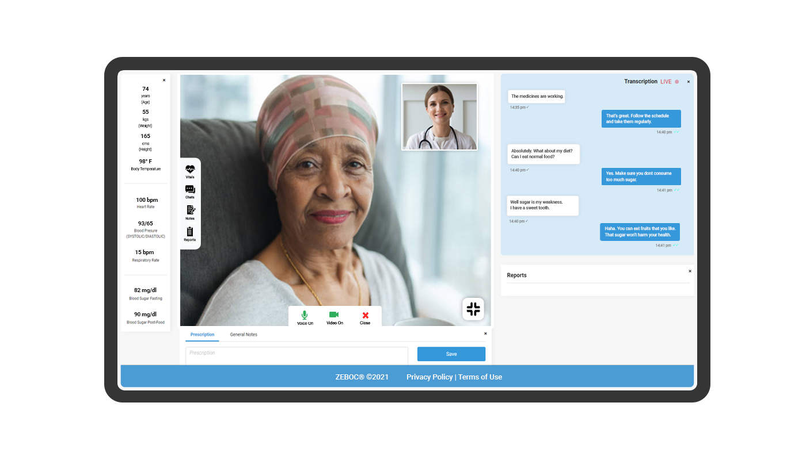
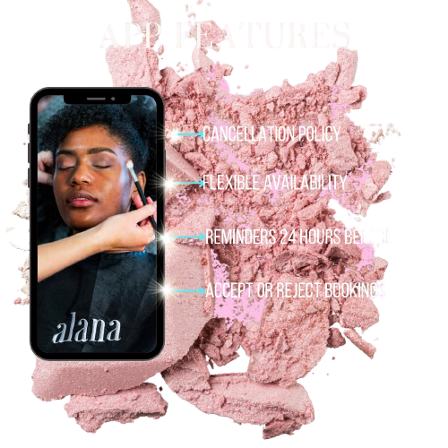

<!-- # Hello!
*Thanks for stopping by*. This repo serves as a kind of ever-changing portfolio of projects I'm currently excited about; please feel free to look around. -->
# Zeboc
A React-Native application for Telemedicine Solutions. This application's main features were video calling, live transcription, and chat. I used Amazon Chime for the video calling functionality, but it was developed in Swift, so I created RCTBridgeModule to communicate between them (React-Native and Swift). I used web-socket for the chat and live transcription. Because this was my first react native application, I interacted with a variety of components such as Text,ListView,Switch,TextView,TextFiled, and so on. Because many components in my application had the same design with minor differences, I created reusable components to reduce code duplication. In the application, I used redux for state management. At the same time, I used Axios for API calls.
I also included Stripe as a payment gateway. The application presented some design challenges. I needed to design a tag view with custom functionality, so I used a third-party library and modified it for my application.

I'm extremely pleased with how the project came out. I'm particularly proud of the app's  UI design, and easily-extended architecture.  

# Alana
A Booking Platform for the Beauty Industry built in React-Native. As The app's design is very impressive, and it is still in development. This application's basic concept was to book appointments in various beauty businesses. User can follow their fashion designers and on their basics that they can see different types of products made by them. Furthermore, if the service like hair cut and beauty pallor is available, user can book the time slot and make reservation. The application is built on functional components, and I used react-hooks such as useState and useEffect to monitor data and perform operations. I added support for dark mode. Rather than creating two applications, one for the customer and one for the provider, I created a single application and managed the operations.

The most challenging aspect of the application was maintaining the payment status flow, which included payment success, payment failure, and returning the payable amount to the customer.

