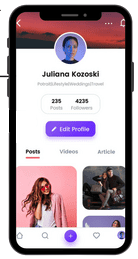

<!-- # Hello!
*Thanks for stopping by*. This repo serves as a kind of ever-changing portfolio of projects I'm currently excited about; please feel free to look around. -->
# Zeboc
A React-Native application for Telemedicine Solutions. This application's main features were video calling, live transcription, and chat. I used Amazon Chime for the video calling functionality, but it was developed in Swift, so I created RCTBridgeModule to communicate between them (React-Native and Swift). I used web-socket for the chat and live transcription. Because this was my first react native application, I interacted with a variety of components such as Text,ListView,Switch,TextView,TextFiled, and so on. Because many components in my application had the same design with minor differences, I created reusable components to reduce code duplication. In the application, I used redux for state management. At the same time, I used Axios for API calls.
I also included Stripe as a payment gateway. The application presented some design challenges. I needed to design a tag view with custom functionality, so I used a third-party library and modified it for this application.

I'm extremely pleased with how the project came out. I'm particularly proud of the app's  UI design, and easily-extended architecture.  

# Alana
A Booking Platform for the Beauty Industry built in React-Native. The app's design is very impressive, and it is still in development. This application's basic concept was to allow user to view products/services provided by varios beauty businesses, allow the user to follow them updates, and also book appointments for various beauty businesses. The application is built on functional components, and I used react-hooks such as useState and useEffect to monitor data and perform operations. I added support for dark mode. Rather than creating two applications, one for the customer and one for the provider, we created a single application and managed the operations.

The most challenging aspect of the application was maintaining the payment status flow, which included payment success, payment failure, and returning the payable amount to the customer.

# Battuta
This is a small application whose goal is to show nearby tourist attractions. A user can view the locations both in the list and on the map. The application allows the user to plan their trip and add and remove friends from that trip plan. 
A vital requirement of this application was the need to reuse it for different countries. So I created a json file and placed the data in that json file on the server, and now we have different applications for different types of countries. The serach function allows the user to search for a location.

&nbsp;&nbsp;&nbsp;&nbsp;&nbsp;

# DineNow

This application is developed using Swift5. It was a complex application and we worked in a team of eight. For application development, we used MVC architecture and singletons. My main responsibility was to create fill-in forms, add validation, and handle the API call response. I also worked on animation in the app and designed a QR code scanner. We used Auto Layout and StackView for UI design and makes extensive use of both UIView animations and CAEmitterLayers. [Read more](https://apps.apple.com/us/app/dinenow/id1496734319)

I'm very happy with how the project turned out. I'm especially pleased with the app's animation, UI design, and extensible architecture.

# AirShare

This application made extensive use of both Google Maps and Apple Maps APIs. It was built in Objective-C. 
It has two main functions: 
- The first is to draw the air space for the drone on Google Maps and Apple Maps. Circle, Polygon, Polyline, and custom shapes based on codrinates sent by the server on both map.
- The second function was to monitor the drone's location on the map and draw the drone's fight path on the map. Core Location was used to manage coordinates. The main challenge in this application was that there were more than 350+ shapes drowned on the map, and when the user performed a pinch to zoom, the colour of the shape changed, so that issue was solved by providing the colour based on shape ID.

# Contact Info:

- Email: vipalkharva99@.com
- LinkedIn: [vipal kharva](https://www.linkedin.com/in/vipal-kharva-9a430012a/)

